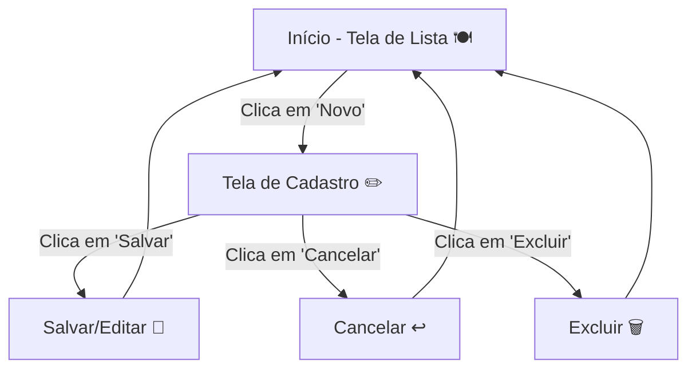

Pizzaria Admin App 🍕🚀
Este projeto é uma interface administrativa para a pizzaria Pizzaria de Marte. Ele foi desenvolvido usando Apache Cordova para criar um aplicativo híbrido que gerencia o cadastro, edição e exclusão de pizzas.

---

📋 Visão Geral
O aplicativo possui duas telas principais:

Tela de Lista: Exibe as pizzas cadastradas e oferece um botão para adicionar uma nova pizza.
Tela de Cadastro: Permite inserir ou editar os dados da pizza (nome, preço e foto).
As requisições para o servidor são feitas para o endpoint https://pedidos-pizzaria.glitch.me usando os métodos HTTP adequados (GET, POST, PUT, DELETE).

🛠️ Requisitos e Configuração

Apache Cordova: Utilize o comando abaixo para criar o projeto:

```js
cordova create pizzaria-admin pizzaria.admin PizzariaAdminApp
```

Configuração de Segurança: No arquivo index.html, altere a política de segurança:
```js
<meta http-equiv="Content-Security-Policy" content="default-src 'self' data: https://ssl.gstatic.com 'unsafe-eval'; style-src 'self' 'unsafe-inline'; media-src *; img-src * data: content:;">
```
CSS: Use o CSS fornecido para definir o layout e a aparência das telas.

---

💻 Estrutura do Projeto
Arquivos Principais
index.html: Define a estrutura das telas, com as divs app-lista e app-cadastro.
index.js: Contém a lógica do aplicativo para alternar entre as telas, enviar dados para o servidor e carregar a lista de pizzas.
Diagrama de Fluxo


---

🚀 Como Executar

Para Testar no Android

Adicione a plataforma Android:
```js
cordova platform add android
```

Compile e Rode o Projeto:

```js
cordova run android
```

Obs.: Conecte um dispositivo real ou utilize um emulador. Certifique-se de que o dispositivo esteja com a depuração USB ativada.

---

🔗 Endpoints Importantes

Cadastrar/Editar Pizza:

POST ou PUT para:

https://pedidos-pizzaria.glitch.me/admin/pizza/
Corpo da requisição:

```json
{
    "pizzaria": "Pizzaria de Marte",
    "pizza": "Nome da Pizza",
    "preco": "Preço da Pizza",
    "imagem": "Imagem em base64 ou URL"
}
```

Listar Pizzas:

GET em:
https://pedidos-pizzaria.glitch.me/admin/pizzas/Pizzaria de Marte
Excluir Pizza:
DELETE para:
https://pedidos-pizzaria.glitch.me/admin/pizza/Pizzaria de Marte/NOME_DA_PIZZA

---

📚 Considerações Finais

Troca de Telas: A lógica de navegação entre a lista e o cadastro é feita via JavaScript, alterando o display das divs.
Plugin HTTP do Cordova: Certifique-se de que o plugin esteja instalado e configurado corretamente para enviar os dados no formato JSON.
Emojis e Diagrama: Esperamos que os emojis 🌟 e o diagrama em Mermaid ajudem a visualizar o fluxo do aplicativo de forma mais divertida e clara! 🎉
